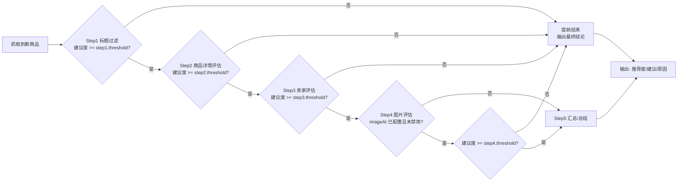

# 闲鱼监控机器人 (AI Goofish)

基于 `Playwright + FastAPI` 的闲鱼商品监控与采集系统，支持多任务调度、Web 管理界面、结果存储与查询，可选接入 AI 评估与多种通知方式。

------------------------------------------------------------------------

## 🖼️ 页面截图

### 1. 登录


### 2. 主页


### 3. 结果查看


### 4. 任务日志


### 4. 设置页

<div style="display: flex; overflow: scroll">
  
  
</div>


------------------------------------------------------------------------

## 📂 项目结构

```
./
├── src/                  # Python 后端
├── webui/                # Vue 3 前端UI
├── resources/            # 前端构建产物
├── tests/                # Python unittest
├── jsonl/                # 采集结果
├── tasks.json            # 任务配置
├── app.config            # 系统配置
├── ai.config             # AI 配置
├── notifier.config       # 通知配置
├── dev.py                # 一键开发
└── docker-compose.yml    # Docker Compose
```

说明：`webui/` 是子模块。首次拉取建议使用 `--recurse-submodules`，或执行 `git submodule update --init --recursive`。

------------------------------------------------------------------------

## ✨ 功能列表

- [x] 多任务并行监控与定时调度
- [x] 支持关键词、页数、价格区间、个人闲置等筛选条件
- [x] 采集商品信息与卖家资料
- [x] FastAPI 提供任务/结果/系统/AI/通知配置等管理接口
- [x] Web 管理界面：任务管理、运行状态、结果查看
- [x] AI 商品评估器：分步评估 + 阈值提前结束（减少 Token）+ **支持所有AI配置**
- [x] 通知：ntfy / gotify / 企业微信 webhook
- [x] Docker 一键部署

### 🧠 商品评估器（AI 商品评估）

商品评估器会对每个新抓取到的商品进行分步评估。

#### 优势与特点

- 分步评估流程：标题过滤 → 商品详情（可信度/符合度）→ 卖家画像（可信度）→（可选）图片一致性/风险信号 → 汇总结论
- 支持“提前结束”：任一步骤低于阈值即终止后续评估，减少无效 AI 调用
- 可通过 webui 配置步骤阈值

#### 🧭 评估流程图



#### 配置方式（`data/app.config`）

```json
{
  "evaluator": {
    "enabled": true,
    "textAI": "openai-gpt-4",
    "imageAI": null,
    "steps": {
      "step1": { "threshold": 30 },
      "step2": { "threshold": 50 },
      "step3": { "threshold": 50 },
      "step4": { "threshold": 50, "disabled": false }
    }
  }
}
```

#### web配置

- 可通过 WebUI 的 `系统设置` → `商品评估器设置` 配置开关、文本/图像模型、每一步阈值与禁用开关

#### 为什么要使用“阈值提前结束”

- 评估器是“多步多次调用 AI”的流水线：每多跑一步，就会额外产生该步的输入/输出 token
- 通过 `threshold` 做 gate（低于阈值就提前结束），可以跳过后续步骤的 AI 调用，从而减少整体 token、成本与延迟

------------------------------------------------------------------------

## ⚡ 快速开始

更完整的一键开发说明见 [QUICKSTART.md](./QUICKSTART.md)。

### Docker 部署

#### docker 命令一键部署

```bash
# 部署 
docker run -d -p 8000:8000 -v ~/config/ai-goofish:/app/data --name ai-goofish justads/ai-goofish:latest

# 更新
docker pull justads/ai-goofish:latest \
  && docker stop ai-goofish \
  && docker rm ai-goofish \
  && docker run -d -p 8000:8000 \
     -v ~/config/ai-goofish:/app/data \
     --name ai-goofish \
     justads/ai-goofish:latest
```

#### 使用docker compose

1) 拉取代码

```bash
git clone https://github.com/just-ads/ai-goofish.git
cd ai-goofish
```

3) （可选）创建 `.env`

```bash
cp .env.example data/.env
```

4) 启动

```bash
docker compose up --build -d
```

访问：`http://127.0.0.1:8000`

### 本地开发（推荐）

使用一键脚本启动前后端开发服务器：

```bash
python dev.py
```

- 后端：`http://127.0.0.1:8000`
- 前端：`http://127.0.0.1:5173`

### 手动启动（后端/前端分开）

1) 安装后端依赖

```bash
python -m venv .venv
# Windows
.venv\Scripts\activate
# Linux/macOS
# source .venv/bin/activate

pip install -r requirements.txt
playwright install
```

2) 启动后端

```bash
python start.py
```

3) 前端开发

```bash
cd webui
npm install
npm run dev
```

4) 构建前端到 `resources/`

```bash
cd webui
npm run build
```

------------------------------------------------------------------------

## ⚙️ 配置说明

配置文件目录为 `data/`

### 1) 环境变量（`.env`）

示例见 `.env.example`，主要用于基础服务配置：

- `SERVER_PORT`：服务端口（默认 8000）
- `WEB_USERNAME` / `WEB_PASSWORD`：Web 登录用户名/密码（默认 admin/admin）

注意：生产环境务必修改默认密码。

### 2) 系统配置（`app.config`）

可用示例：

```bash
cp app.example.config data/app.config
```

### 3) AI 配置（`ai.config`）

可用示例：

```bash
cp ai.example.config data/ai.config
```

### 4) 通知配置（`notifier.config`）

可用示例：

```bash
cp notifier.example.config data/notifier.config
```

------------------------------------------------------------------------

## 🧪 测试

```bash
python -m unittest discover tests/
```

------------------------------------------------------------------------

## 🔐 安全与仓库卫生（重要）

以下文件/目录通常包含运行时数据或敏感信息，不建议提交到版本库：

- `data/*`

------------------------------------------------------------------------

## 💖 鸣谢

- [ai-goofish-monitor](https://github.com/dingyufei615/ai-goofish-monitor)

------------------------------------------------------------------------

# 免责声明

本系统/平台/软件（以下简称“本服务”）所提供的内容、资料及相关信息，仅供参考与学习使用。使用者在使用本服务时，应自行判断其适用性与风险。

## 1. 内容准确性

本服务尽力确保所提供的信息完整、准确，但不对其及时性、可靠性或适用性作出任何保证。使用者应在依赖前进行独立验证。

## 2. 责任限制

因使用或无法使用本服务所导致的任何直接或间接损失、数据丢失、系统故障或其他后果，本服务提供方均不承担任何责任。

## 3. 第三方链接或资源

本服务可能包含第三方提供的链接、接口或资源，本服务对其内容或使用结果不作任何保证或承诺。

## 4. 法律遵循

使用者在使用本服务时，应遵守所在地相关法律法规，若因使用不当而违反法律规定，责任由使用者自行承担。

## 5. 免责声明的变更

本服务有权随时修改或更新本免责声明，修改后的内容一经公布即刻生效。
